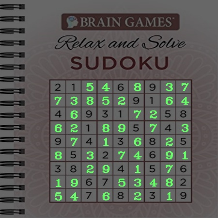

# Sudoku Solver using Computer Vision and Deep Learning

*Self Learning Project by*

**Siddhant Chourasia**
B.Tech | Electrical Engineering | IIT Bombay

---

## **Overview**

This project aims to create a Sudoku solver using computer vision techniques and deep learning. The solver takes an image of a Sudoku puzzle as input, processes it using OpenCV and NumPy, utilizes a pre-trained deep learning model built with TensorFlow's Keras API to recognize the digits in the puzzle, and finally solves the puzzle using a backtracking algorithm.

## **Importing Libraries**

We start by importing essential libraries for our project:

- NumPy: A library for numerical operations in Python.
- OpenCV (cv2): An open-source computer vision library used for image processing tasks.
- OS: Provides a way of using operating system-dependent functionality.
- Matplotlib: A plotting library to visualize data and images.
- TensorFlow's Keras: A high-level neural networks API for building and training deep learning models.

## **Hyperparameters**

In this section, we define various hyperparameters that are crucial for image preprocessing and model training:

- IMG_HEIGHT: The desired height of images during preprocessing.
- IMG_WIDTH: The desired width of images during preprocessing.
- batchSizeVal: The batch size used during training the CNN model.
- epochsVal: The number of epochs or iterations for model training.
- stepsPerEpochVal: The number of steps per epoch during training.

## **Image Preprocessing**

The image preprocessing step is a crucial part of this project, as it prepares the input images for further analysis. We define two image preprocessing functions:

1. `preProcessing`: This function converts an image to grayscale, equalizes its histogram, and normalizes pixel values to the range [0, 1]. These steps enhance the contrast and make the images suitable for the deep learning model.

2. `preProcess`: This function is specifically designed for Sudoku images. It applies additional preprocessing steps, including converting the image to grayscale, applying Gaussian blur to reduce noise, and adaptive thresholding to create a binary image with clear cell boundaries.

## **EDA and Data Loading**

In this section, we load the dataset of Sudoku puzzle images. We loop through each class (digits 0 to 9), read the images, resize them to a specific size (imageDimensions), and store them in the 'images' list. The corresponding class labels are stored in the 'classNo' list. The data is then split into training, testing, and validation sets using scikit-learn's train_test_split.

## **Data Preprocessing**

The loaded images are preprocessed using the `preProcessing` function. Additionally, the depth of the images is adjusted to 1 to represent grayscale images. The target labels are one-hot encoded using TensorFlow's Keras `to_categorical`.

## **Model Definition**

The `myModel` function defines a convolutional neural network (CNN) model using the Keras Sequential API. The model consists of convolutional layers, max-pooling layers, dropout layers for regularization, and fully connected layers. The final layer uses softmax activation for multi-class classification.

## **Training and Evaluation**

The model is compiled and trained using the `fit_generator` function. During training, we utilize an ImageDataGenerator for data augmentation to increase the model's robustness. The training history is recorded for later visualization. After training, the model is evaluated on the test set, and the test accuracy is printed.

## **Sudoku Solver Algorithm**

We define a set of functions for solving the Sudoku puzzle. The algorithm uses backtracking to find the solution. The functions `foundInCol`, `foundInRow`, and `foundInBox` check if a number is already present in the respective column, row, or 3x3 box of the Sudoku grid. The `isSafe` function checks if it's safe to place a number in a specific cell based on Sudoku rules. The function `foundEmptyCell` finds the next empty cell in the Sudoku grid. The `solveSudoku` function is a recursive function that solves the Sudoku puzzle using backtracking.

## **Making Predictions**

Finally, we load an input image of a Sudoku puzzle, preprocess it, and find the largest contour representing the puzzle. If a valid Sudoku puzzle is detected, we use the Sudoku solver algorithm to solve it. The solution is then displayed on the original image.

## **Conclusions**

In conclusion, this project demonstrates the successful combination of computer vision and deep learning to tackle a classic puzzle-solving task. By accurately recognizing digits within the puzzle and employing a backtracking algorithm, we were able to efficiently solve Sudoku puzzles. This project serves as a great example of the powerful capabilities of AI and its potential to solve real-world problems
